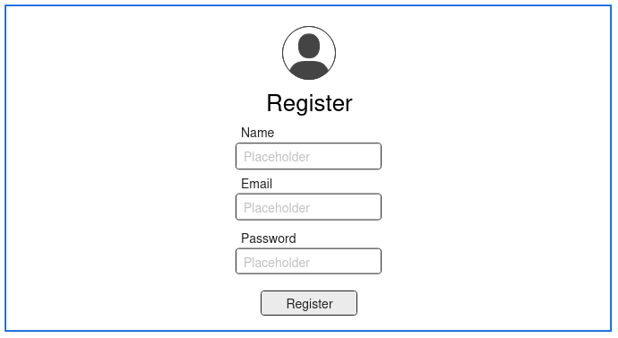

# Actividad 3. Del concepto al prototipo: diseño de una aplicación web

***Nombre:*** Nabil León Álvarez, Dario Acosta Gonzalez y Pedro Martín Escuela 
 
***Curso:*** 2º de Ciclo Superior de Desarrollo de Aplicaciones Web.

### ÍNDICE

+ [Introducción](#id1)
+ [Desarrollo](#id2)
+ [Conclusiones](#id3)

#### ***Introducción***. 

La idea para nuestra aplicación web ha sido la creación de un blog para juegos, donde el creador expresa una pequeña descripción de su juego acompañada de algunos detalles como fecha de lanzamiento, quien lo desarrolló, quien lo distribuyó, donde se puedia o puede jugar y ademas las valoraciones de los usuarios donde pueden ofrecer una breve review del juego y aparte tu o el resto de los jugadores pueden ver o dejar registrado los juegos que estas jugando, que te haz pasado o que estás jugando de nuevo

#### ***Desarrollo***. 

##### Mapa de Navegación
Hemos realizado el mapa de navegación con la siguiente herramienta [Miro](miro.com).

> [Enlace al proyecto en Miro.](https://miro.com/welcomeonboard/OWEvV2JHUXF5bFlTekl0MGxaVWdPclpRZlh2enhHZEg1cjVsdHJCTnhBbFo2U2x2Qjh1VXFZOXlvaW9GRlQ3anl2RXlFUytZOUxTNVowSGJVNmlHekwxZjdkR2E2WnhWZmpPR3dTSDQ3VEdjOWlFL1NLMmdxeGxPR1lyNG9kRVVhWWluRVAxeXRuUUgwWDl3Mk1qRGVRPT0hdjE=?share_link_id=344454388427)

##### Sketch
Hemos realizado el skecth a mano alzada, y ha quedado de la siguiente manera:

##### Wireframe
En cuanto al Wireframe de la aplicación hemos usado [Moqups](moqups.com/es).

    
    
    
    

> [Enlace al proyecto en Moqups.]()

##### Mockup y Prototipo

Para llevar a cabo tanto el mockup como el prototipo hemos utilizado [Penpot](https://penpot.app/).

- Version de Navegador:

***

 

- Version de Table:

***

 

- Version de Móvil:

***

 

- Prototipo:

***

 

#### ***Conclusiones***. 

En esta parte debemos exponer las conclusiones que sacamos del desarrollo de la prácica.

