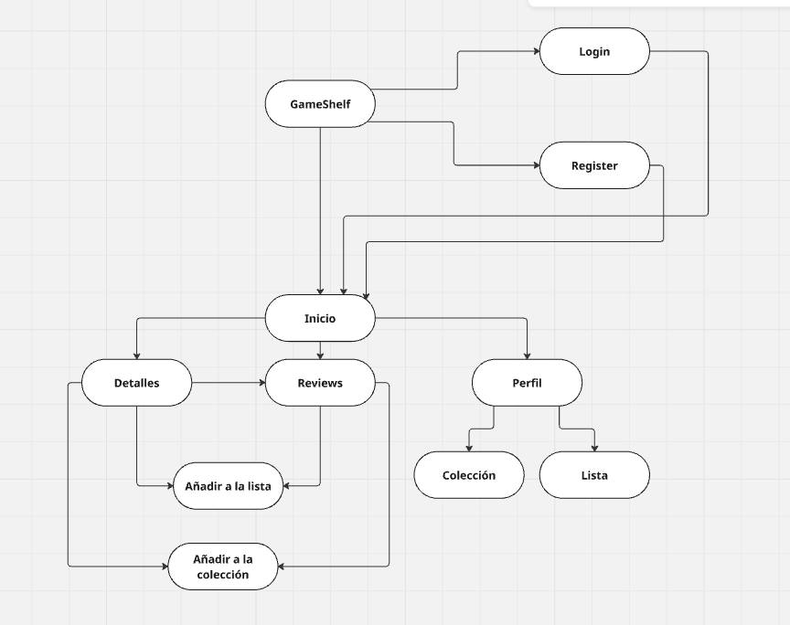
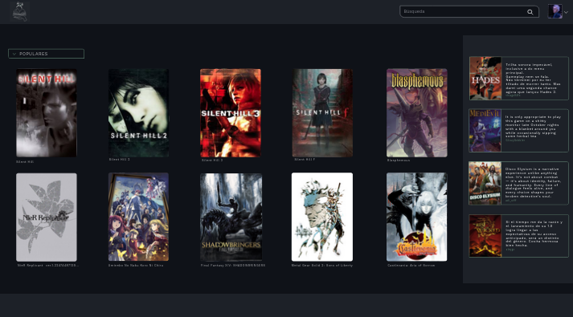
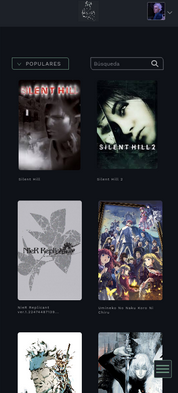

# Actividad 3. Del concepto al prototipo: diseño de una aplicación web

***Nombre:*** Nabil León Álvarez, Dario Acosta Gonzalez y Pedro Martín Escuela 
 
***Curso:*** 2º de Ciclo Superior de Desarrollo de Aplicaciones Web.

### ÍNDICE

+ [Introducción](#id1)
+ [Desarrollo](#id2)

#### ***Introducción***. 

La idea para nuestra aplicación web ha sido la creación de un blog para llevar un registro de los juegos tanto que queramos jugar/tengamos planeados/hayamos dejado/pausado así como añadirlos a un registro de colección (teniendo dos registros distintos, uno para colección y otro para la lista). Además se puedes crear reviews.

#### ***Desarrollo***. 

En primer lugar, seleccionamos la siguiente paleta de colores:

##### Mapa de Navegación
Hemos realizado el mapa de navegación con la siguiente herramienta [Miro](miro.com). 

> [Enlace al proyecto en Miro.](https://miro.com/welcomeonboard/OWEvV2JHUXF5bFlTekl0MGxaVWdPclpRZlh2enhHZEg1cjVsdHJCTnhBbFo2U2x2Qjh1VXFZOXlvaW9GRlQ3anl2RXlFUytZOUxTNVowSGJVNmlHekwxZjdkR2E2WnhWZmpPR3dTSDQ3VEdjOWlFL1NLMmdxeGxPR1lyNG9kRVVhWWluRVAxeXRuUUgwWDl3Mk1qRGVRPT0hdjE=?share_link_id=344454388427)

##### Sketch
Por parte del skecth, lo hemos hecho a mano alzada, y ha quedado de la siguiente manera:

Podemos observar como se han diseñado las pantallas de autenticación y la página principal.

##### Wireframe
En cuanto al Wireframe de la aplicación hemos usado [Moqups](moqups.com/es). 

En esta etapa del diseño decidimos añadir una pantalla más que en el sketch para detallar la aplicación un poco más, así que obtenemos un total de 4 pantallas (register, login (autenticación), home y pantalla de detalles de un juego).

    
    
    
    

> [Enlace al proyecto en Moqups.](https://app.moqups.com/izG072Ba1bnODchJuS7rsXmJGD67F0t9/view/page/ad64222d5)

##### Mockup y Prototipo

Para llevar a cabo tanto el mockup como el prototipo hemos utilizado [Penpot](https://penpot.app/). 

Este muestra la ruta que seguiría un usuario que se registra para usar la web (el registro es opcional). Luego de registrarse es llevado al login, y luego de iniciar sesión accede al home. 

El home es visible para usuarios no registrados también, pero tendría algunas funciones limitadas, como añadir juegos a tu colección, a tu lista y dejar una review. 

Al hacer click en un juego, te lleva a la página de detalles sobre este, donde si está registrado, podría darle una puntuación y dejar una review.

- Version de Navegador:

    
    
    
    

***

 

- Version de Tablet:

***

 

- Version de Móvil:

***

 

- Prototipo:

***

